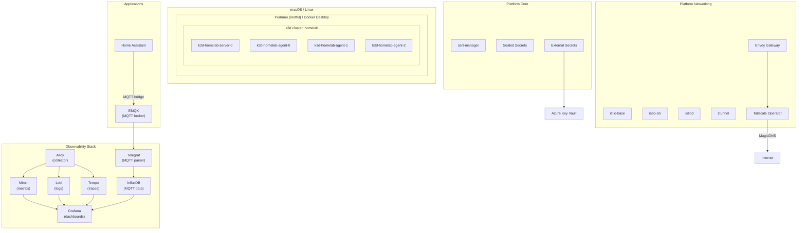
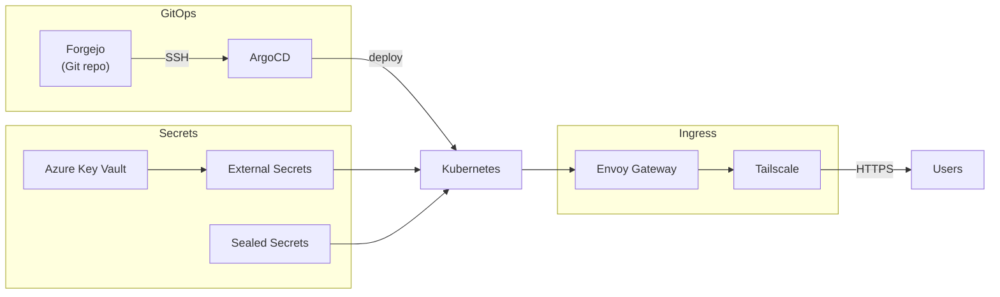
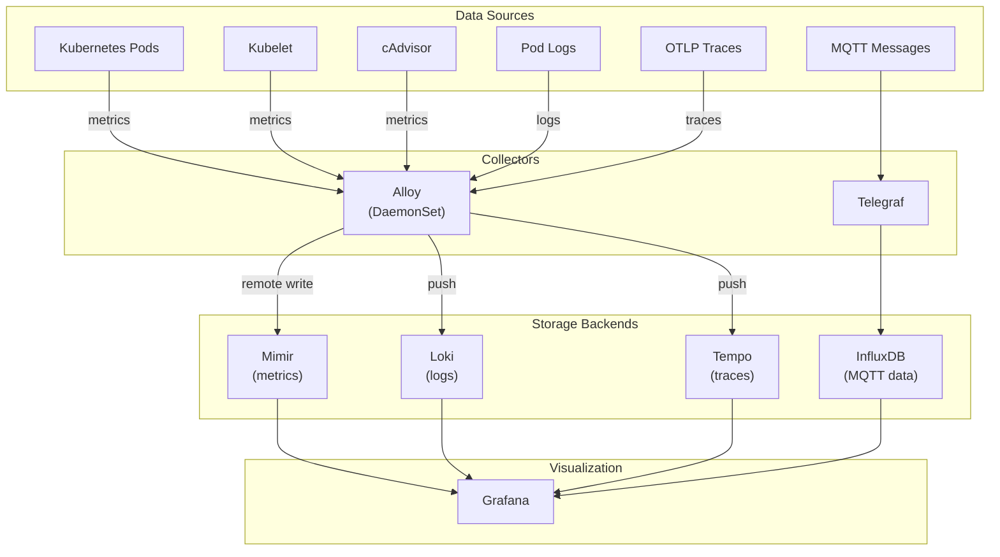
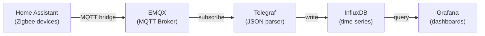
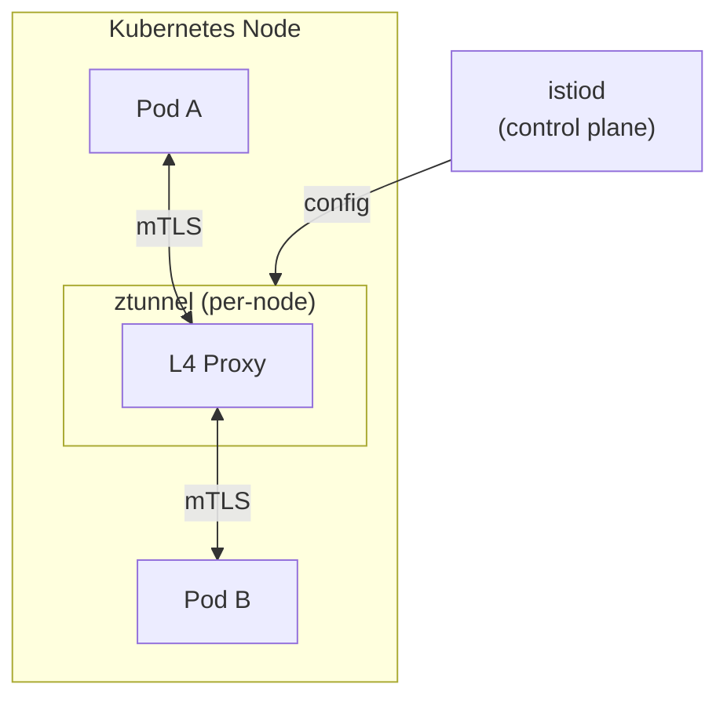
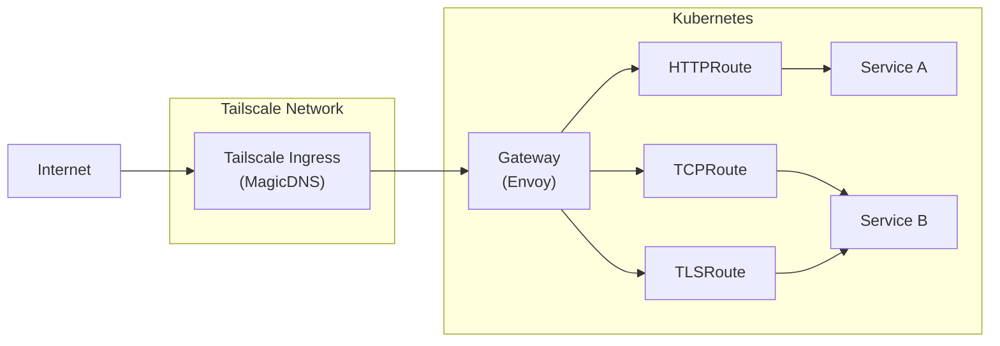

# cd-homelab

[](https://kubernetes.io/)
[](https://argoproj.github.io/cd/)
[](https://istio.io/)
[](https://grafana.com/)

Production-grade Kubernetes homelab running locally on macOS/Linux with full GitOps, service mesh, and observability stack.

## Features

| Category | Components |
|----------|------------|
| **Runtime** | Podman (rootful) / Docker Desktop |
| **Cluster** | k3d (k3s in containers) - 1 server + 3 agents |
| **GitOps** | ArgoCD with ApplicationSets |
| **Service Mesh** | Istio Ambient (sidecar-less, L4 mTLS) |
| **Gateway** | Envoy Gateway (Gateway API) |
| **Ingress** | Tailscale MagicDNS (automatic HTTPS) |
| **Secrets** | Sealed Secrets + External Secrets → Azure Key Vault |
| **TLS** | cert-manager with self-signed CA |
| **Observability** | Grafana LGTM (Mimir, Loki, Tempo, Alloy) |
| **Storage** | local-path (RWO) + NFS CSI → Synology NAS (RWX) |

## Architecture



## Component Flow



## Prerequisites

| Tool | Installation | Purpose |
|------|--------------|---------|
| Docker Desktop or Podman | `brew install --cask docker` or `brew install podman` | Container runtime |
| just | `brew install just` | Command runner |
| k3d | `brew install k3d` | Kubernetes in Docker |
| helm | `brew install helm` | Package manager |
| kubectl | `brew install kubectl` | Kubernetes CLI |
| kubeseal | `brew install kubeseal` | Sealed Secrets CLI |
| yq | `brew install yq` | YAML processor |
| Tailscale | `brew install --cask tailscale` | Remote access |

## Quick Start

```bash
# 1. Clone repository
git clone git@github.com:tomasz-wostal-eu/cd-homelab.git
cd cd-homelab

# 2. Configure environment
cp .env.example .env
# Edit .env with your Azure credentials

# 3. Full setup (auto-detects runtime)
just setup

# 4. Bootstrap GitOps stack
just bootstrap-all

# 5. Deploy all components
kubectl apply -f bootstrap/argocd-projects/
kubectl apply -f applicationsets/

# 6. Access ArgoCD UI
just argocd-ui
```

## Services

### Tailscale Ingress (MagicDNS)

| Service | URL |
|---------|-----|
| ArgoCD | https://argocd-homelab.tailc90e09.ts.net |
| Grafana | https://grafana-homelab.tailc90e09.ts.net |
| EMQX Dashboard | https://emqx-homelab.tailc90e09.ts.net |
| InfluxDB | https://influxdb-homelab.tailc90e09.ts.net |

### MQTT Endpoints

| Port | Protocol | Description |
|------|----------|-------------|
| 1883 | TCP | Plain MQTT |
| 8883 | TLS | MQTT over TLS (MQTTS) |
| 8083 | TCP | MQTT over WebSocket |
| 8084 | TLS | WebSocket Secure (WSS) |

## Commands

```bash
# Lifecycle
just setup              # Full setup: runtime + cluster + kubeconfig
just start              # Start runtime + cluster
just stop               # Stop everything
just status             # Show full status
just info               # Show environment info

# Cluster
just cluster-create     # Create k3d cluster
just cluster-delete     # Delete cluster
just cluster-restart    # Recreate (preserves secrets)

# GitOps
just argocd-ui          # Port-forward + show password
just argocd-password    # Get admin password

# Secrets
just sealed-secrets-install     # Install Sealed Secrets
just external-secrets-install   # Install External Secrets
just azure-credentials-create   # Create Azure KV secret

# Debugging
just nodes              # List nodes
just pods               # List all pods
just events             # Recent cluster events
```

## Deployment Order

```mermaid
flowchart LR
    subgraph Wave-3["-3"]
        ArgoCD["ArgoCD"]
    end

    subgraph Wave-2["-2"]
        CertManager["cert-manager"]
        SealedSecrets["Sealed Secrets"]
    end

    subgraph Wave-1["-1"]
        ExternalSecrets["External Secrets"]
        IstioBase["istio-base"]
    end

    subgraph Wave0["0"]
        IstioCNI["istio-cni"]
        Tailscale["Tailscale"]
    end

    subgraph Wave1["1"]
        Istiod["istiod"]
        EMQX["EMQX"]
    end

    subgraph Wave2["2"]
        Ztunnel["ztunnel"]
    end

    subgraph Wave3["3"]
        EnvoyGW["Envoy Gateway"]
    end

    subgraph Wave4["4"]
        Mimir["Mimir"]
        Loki["Loki"]
        Tempo["Tempo"]
        InfluxDB["InfluxDB"]
    end

    subgraph Wave5["5"]
        Alloy["Alloy"]
        Telegraf["Telegraf"]
    end

    subgraph Wave6["6"]
        Grafana["Grafana"]
    end

    Wave-3 --> Wave-2 --> Wave-1 --> Wave0 --> Wave1 --> Wave2 --> Wave3 --> Wave4 --> Wave5 --> Wave6
```



| Wave | Component | Description |
|------|-----------|-------------|
| -3 | argocd | GitOps controller |
| -2 | cert-manager | TLS certificate management |
| -2 | sealed-secrets | Encrypted secrets in Git |
| -1 | external-secrets | Azure Key Vault sync |
| -1 | istio-base | Istio CRDs |
| 0 | istio-cni | CNI for ambient mesh |
| 0 | tailscale | Tailscale operator |
| 1 | istiod | Istio control plane |
| 1 | emqx | MQTT broker |
| 2 | ztunnel | L4 mTLS proxy |
| 3 | envoy-gateway | Gateway API |
| 4 | mimir, loki, tempo | Observability backends |
| 4 | influxdb | MQTT time-series |
| 5 | alloy, telegraf | Collectors |
| 6 | grafana | Dashboards |

## Project Structure

```
cd-homelab/
├── applicationsets/           # ArgoCD ApplicationSets
│   ├── argocd.yaml
│   ├── cert-manager.yaml
│   ├── sealed-secrets.yaml
│   ├── external-secrets.yaml
│   ├── istio-*.yaml
│   ├── envoy-gateway.yaml
│   ├── tailscale.yaml
│   ├── grafana-mimir.yaml
│   ├── grafana-loki.yaml
│   ├── grafana-tempo.yaml
│   ├── grafana-alloy.yaml
│   ├── grafana.yaml
│   ├── influxdb.yaml
│   ├── telegraf.yaml
│   └── emqx.yaml
│
├── bootstrap/
│   └── argocd-projects/       # ArgoCD AppProjects
│       ├── platform-core.yaml
│       ├── platform-networking.yaml
│       ├── platform-storage.yaml
│       └── apps.yaml
│
├── values/                    # Helm values
│   └── {component}/
│       ├── common/values.yaml
│       └── local/homelab/values.yaml
│
├── extras/local/              # Additional K8s resources
│   ├── argocd/
│   ├── cert-manager/
│   ├── emqx/
│   ├── grafana/
│   ├── influxdb/
│   ├── telegraf/
│   └── external-secrets/
│
├── k3d/
│   ├── config.yaml            # macOS config
│   └── config-linux.yaml      # Linux config
│
├── justfile                   # Automation recipes
├── CLAUDE.md                  # AI assistant instructions
└── README.md                  # This file
```

## Observability Stack

### Grafana LGTM

| Component | Purpose | Retention |
|-----------|---------|-----------|
| **Mimir** | Metrics (Prometheus-compatible) | 7 days |
| **Loki** | Log aggregation | 7 days |
| **Tempo** | Distributed tracing | 7 days |
| **Alloy** | Collection (DaemonSet) | - |

### Data Flow



### MQTT Data Pipeline



### Adding Metrics to Your App

Add prometheus annotations to your pods:

```yaml
annotations:
  prometheus.io/scrape: "true"
  prometheus.io/port: "8080"
  prometheus.io/path: "/metrics"  # optional
```

## Networking

### Service Mesh (Istio Ambient)



### Gateway API



## Troubleshooting

### Runtime Issues

```bash
# Docker Desktop not responding
docker context use default
docker ps

# Podman - permission denied on ports 80/443
podman machine stop
podman machine set --rootful
podman machine start
```

### ArgoCD Issues

```bash
# Check sync status
kubectl get applications -n argocd

# View application logs
kubectl logs -n argocd -l app.kubernetes.io/component=repo-server --tail=50

# Force refresh
kubectl patch application <name> -n argocd --type=merge \
  -p '{"operation": {"sync": {"revision": "HEAD"}}}'
```

### Mimir Issues

```bash
# Check distributor logs
kubectl logs -n monitoring -l app.kubernetes.io/component=distributor --tail=50

# Common errors:
# - "at least 2 live replicas required" → replication_factor: 1 in config
# - "max-label-names-per-series" → increase to 50+ for Istio
# - OOMKilled → increase memory limits (ingester: 2Gi, distributor: 1Gi)
```

### Certificate Issues

```bash
# Check certificates
kubectl get certificates -A
kubectl describe certificate <name> -n <namespace>

# Check ClusterIssuer
kubectl get clusterissuer
kubectl describe clusterissuer homelab-ca-issuer
```

### Istio Issues

```bash
# Check components
kubectl get pods -n istio-system

# Enable ambient for namespace
kubectl label namespace <ns> istio.io/dataplane-mode=ambient

# Check ztunnel logs
kubectl logs -n istio-system -l app=ztunnel --tail=50
```

## Azure Key Vault Secrets

| Secret | Used By |
|--------|---------|
| `argocd-cd-homelab-ssh-key` | ArgoCD Git access (Forgejo) |
| `homelab-tailscale-client-id` | Tailscale operator |
| `homelab-tailscale-client-secret` | Tailscale operator |
| `emqx-bridge-server` | EMQX MQTT bridge |
| `homelab-emqx-dashboard-password` | EMQX dashboard |
| `homelab-influxdb-admin-password` | InfluxDB admin |
| `homelab-influxdb-token` | InfluxDB API token |
| `homelab-grafana-admin-user` | Grafana admin |
| `homelab-grafana-admin-password` | Grafana admin |

## License

MIT
